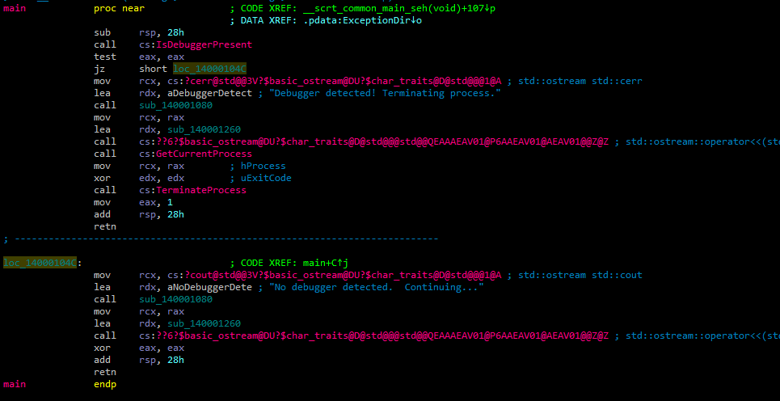
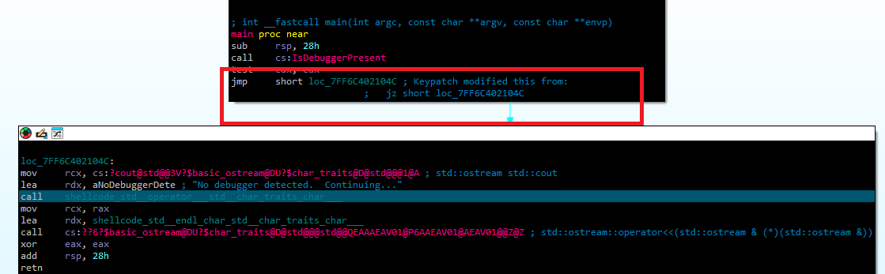

# Debug Flags

## 1. Sử dụng Win32 API

Các kỹ thuật sử dụng các hàm API hiện có (WinAPI hoặc NativeAPI) để kiểm tra cấu trúc hệ thống trong bộ nhớ quy trình (process memory) để tìm các cờ cụ thể cho biết quy trình hiện đang được gỡ lỗi hay không.

### 1.1. IsDebuggerPresent()

Hàm `kernel32!IsDebuggerPresent()` xác định xem tiến trình hiện tại có đang được gỡ lỗi bởi một *debugger* chế độ người dùng (user-mode debugger) hay không, chẳng hạn như `OllyDbg` hoặc `x64dbg`. Về cơ bản, hàm này chỉ kiểm tra cờ `BeingDebugged` của Khối Môi trường Tiến trình (`Process Environment Block - PEB`).

- `PEB` và `BeingDebugged`: `PEB` là một cấu trúc dữ liệu do hệ điều hành tạo ra cho mỗi tiến trình. Nó chứa nhiều thông tin quan trọng về tiến trình đó, bao gồm đường dẫn thực thi, các DLL đã tải, thông tin về heap, và nhiều thứ khác. Cờ `BeingDebugged` là một thành viên (member) của `PEB` và được hệ điều hành đặt thành `TRUE` khi một debugger đính kèm vào tiến trình. Khi không có debugger, cờ này sẽ là `FALSE`. Ví dụ dưới đây là **Cấu trúc PEB** được đơn giản hóa, bằng việc liệt kê một số thành viên quan trong nhất trong `PEB`:

```c
typedef struct _PEB {
  BOOLEAN InheritedAddressSpace;
  BOOLEAN ReadOnlyProcess;
  BOOLEAN ImageBaseAddress; // Địa chỉ cơ sở của file thực thi (EXE/DLL)
  union {
    struct {
      BOOLEAN BeingDebugged; // Cờ chỉ ra tiến trình có đang bị debug hay không
      BOOLEAN BitField; // Các cờ khác
    } Flags1;
    UCHAR Flags2;
  };
  HANDLE Mutant; // Handle của một mutex (đối tượng đồng bộ hóa)
  PVOID ImageBaseAddress; // Địa chỉ cơ sở của image
  PPEB_LDR_DATA Ldr; // Con trỏ đến cấu trúc PEB_LDR_DATA (thông tin về module đã tải)
  PRTL_USER_PROCESS_PARAMETERS ProcessParameters; // Con trỏ đến cấu trúc RTL_USER_PROCESS_PARAMETERS (thông tin dòng lệnh, đường dẫn, v.v.)
  PVOID SubSystemData;
  PVOID ProcessHeap; // Handle của heap mặc định của tiến trình
  PRTL_CRITICAL_SECTION FastPebLock;
  PVOID AtlThunkSListPtr;
  PVOID IFEOKey;
  ULONG CrossProcessFlags;
  ULONG ImageBaseAddress;
  ULONG SizeOfImage;
  ULONG CheckSum;
  ULONG TimeDateStamp;
  PVOID ActivationContextData;
  PVOID ProcessAssemblyStorageMap;
  PVOID SystemDefaultActivationContext;
  PVOID SystemAssemblyStorageMap;
  ULONG MinimumStackBlockFree;
} PEB, *PPEB;
```

- Cách hoạt động đơn giản: `IsDebuggerPresent()` thực hiện một công việc đơn giản: nó truy cập `PEB` của tiến trình hiện tại và trả về giá trị của cờ `BeingDebugged`.

```c
#include <iostream>
#include <windows.h>

int main() {
    if (IsDebuggerPresent()) {
        std::cerr << "Debugger detected! Terminating process." << std::endl;
        TerminateProcess(GetCurrentProcess(), 0); // Kết thúc tiến trình
        return 1; // Không bao giờ đến được dòng này
    } else {
        std::cout << "No debugger detected.  Continuing..." << std::endl;
    }

    // ... phần còn lại của chương trình ...
    return 0;
}
```

Dưới đây là hình ảnh code assembly mở bằng IDA pro:


Hàm `IsDebuggerPresent` được gọi để kiểm tra xem có debugger nào đang gắn vào không.
Kết quả được kiểm tra, nếu phát hiện debugger (`eax` khác không), mã sẽ nhảy đến một vị trí cụ thể để xử lý trường hợp này.

#### Các cách bypass

##### 1. `Patching (sửa đổi)` mã nhị phân

 Thay đổi lệnh `jz` thành `jmp` để luôn nhảy qua đoạn mã xử lý khi debugger được phát hiện. Hoặc có thể thay đổi giá trị trả về của hàm `IsDebuggerPresent` để luôn trả về 0.


##### 2. `Hooking API`

Phương pháp này can thiệp vào quá trình gọi hàm `IsDebuggerPresent` của hệ thống.

Kỹ thuật này có thể tham khảo bài viết sau: [API Hooking](/Tricks/API%20Hooking/API%20Hooking.md)

### 1.2. CheckRemoteDebuggerPresent()

Sử dụng hàm `kernel32!CheckRemoteDebuggerPresent()` để phát hiện xem một tiến trình đang chạy có bị một trình gỡ lỗi (debugger) từ xa đính kèm hay không. Điều này thường được sử dụng như một kỹ thuật chống gỡ lỗi (anti-debugging) để ngăn chặn việc phân tích mã độc hoặc đảo ngược kỹ thuật ứng dụng.

- `kernel32!CheckRemoteDebuggerPresent()`: Đây là hàm API của Windows nằm trong thư viện kernel32.dll. Nó nhận hai tham số:
  - `HANDLE hProcess`: Một **handle** tới tiến trình mà bạn muốn kiểm tra. `GetCurrentProcess()` trả về handle của tiến trình hiện tại.
  - `PBOOL pbDebuggerPresent`: Một con trỏ tới một biến kiểu `BOOL`. Hàm sẽ đặt biến này thành `TRUE` nếu có một debugger được đính kèm, và `FALSE` nếu không.

### 1.3. NtQueryInformationProcess()

Trong lĩnh vực an ninh mạng, hàm `ntdll!NtQueryInformationProcess()` là một công cụ mạnh mẽ để thu thập thông tin chi tiết về một tiến trình đang chạy. Khác với các phương pháp tiếp cận trực tiếp hơn, hàm này cung cấp khả năng truy vấn các loại thông tin đa dạng. Điểm mấu chốt nằm ở tham số `ProcessInformationClass`, tham số này đóng vai trò then chốt trong việc xác định loại thông tin cần truy xuất. Đồng thời, nó cũng quyết định kiểu dữ liệu trả về của tham số `ProcessInformation`. Nói cách khác, `ProcessInformationClass` không chỉ cho biết cái gì bạn muốn biết về tiến trình, mà còn định hình cách thức thông tin đó được trả về, cho phép phân tích viên có thể tùy chỉnh và thu thập các thông tin cần thiết để đánh giá rủi ro và phát hiện các hành vi đáng ngờ.

Dưới đây là cú pháp của `NtQueryInformationProcess` function (winternl.h) nằm trong `ntdll.dll`:

```c++
__kernel_entry NTSTATUS NtQueryInformationProcess(
  [in]            HANDLE           ProcessHandle,
  [in]            PROCESSINFOCLASS ProcessInformationClass,
  [out]           PVOID            ProcessInformation,
  [in]            ULONG            ProcessInformationLength,
  [out, optional] PULONG           ReturnLength
);
```

#### 1.3.1. [ProcessDebugPort](https://learn.microsoft.com/en-us/windows/win32/api/winternl/nf-winternl-ntqueryinformationprocess#PROCESSDEBUGPORT)

Trong số nhiều thông tin có thể truy xuất bằng ntdll!NtQueryInformationProcess(), một thông tin đặc biệt quan trọng trong an ninh mạng là số cổng gỡ lỗi của tiến trình. Sử dụng lớp (class) ProcessDebugPort, một giá trị DWORD sẽ được trả về. Nếu tiến trình đang bị gỡ lỗi (debugged), giá trị DWORD này sẽ bằng 0xFFFFFFFF (tương đương với số thập phân -1). Việc phát hiện giá trị này có thể là một dấu hiệu cảnh báo cho thấy tiến trình đang bị theo dõi và phân tích, từ đó kích hoạt các biện pháp phòng vệ cần thiết.

Đoạn mẫu code C/C++ sau sử dụng kỹ thuật này:

```c++
#include <windows.h> // Bao gồm các định nghĩa Windows API
#include <winternl.h> // Bao gồm các định nghĩa NTAPI (cần có WDK hoặc SDK)

// Định nghĩa kiểu hàm cho NtQueryInformationProcess
// Đây là hàm Windows Native API, không có sẵn trong các header thông thường
typedef NTSTATUS (NTAPI *TNtQueryInformationProcess)(
    IN HANDLE           ProcessHandle,        // Handle đến tiến trình cần truy vấn
    IN PROCESSINFOCLASS ProcessInformationClass, // Loại thông tin cần truy vấn (ví dụ: ProcessDebugPort)
    OUT PVOID           ProcessInformation,     // Con trỏ đến vùng nhớ để lưu thông tin
    IN ULONG            ProcessInformationLength, // Kích thước của vùng nhớ ProcessInformation
    OUT PULONG          ReturnLength           // Con trỏ để lưu kích thước thực tế của dữ liệu trả về
    );

int main() {
    // Tải thư viện ntdll.dll
    HMODULE hNtdll = LoadLibraryA("ntdll.dll");
    if (hNtdll)
    {
        // Lấy địa chỉ của hàm NtQueryInformationProcess từ ntdll.dll
        auto pfnNtQueryInformationProcess = (TNtQueryInformationProcess)GetProcAddress(
            hNtdll, "NtQueryInformationProcess");

        // Kiểm tra xem việc lấy địa chỉ hàm có thành công hay không
        if (pfnNtQueryInformationProcess)
        {
            DWORD dwProcessDebugPort, dwReturned;

            // Gọi hàm NtQueryInformationProcess để lấy thông tin về cổng gỡ lỗi
            // Cần define ProcessDebugPort (thường là trong winternl.h hoặc ntddk.h nếu có WDK)
            NTSTATUS status = pfnNtQueryInformationProcess(
                GetCurrentProcess(), // Lấy handle của tiến trình hiện tại
                ProcessDebugPort,    // Truy vấn thông tin về cổng gỡ lỗi
                &dwProcessDebugPort, // Lưu giá trị cổng gỡ lỗi vào biến này
                sizeof(DWORD),       // Kích thước của biến dwProcessDebugPort
                &dwReturned        // Lưu số byte thực tế trả về
            );

            // Kiểm tra xem tiến trình có đang bị debug hay không
            // Nếu status thành công VÀ cổng gỡ lỗi có giá trị -1 (0xFFFFFFFF), nghĩa là đang bị debug
            if (NT_SUCCESS(status) && (-1 == dwProcessDebugPort))
            {
                // Tiến trình bị debug, thoát ngay lập tức
                ExitProcess(-1); // Thoát với mã lỗi -1
            }
        }
        else
        {
            // Không tìm thấy hàm NtQueryInformationProcess
            // Xử lý lỗi nếu cần
            OutputDebugStringA("Không tìm thấy hàm NtQueryInformationProcess\n");
        }

        // Giải phóng thư viện ntdll.dll sau khi sử dụng (quan trọng!)
        FreeLibrary(hNtdll);
    }
    else
    {
        // Không tải được thư viện ntdll.dll
        // Xử lý lỗi nếu cần
        OutputDebugStringA("Không tải được thư viện ntdll.dll\n");
    }

    // Nếu không bị debug, chương trình tiếp tục chạy ở đây
    OutputDebugStringA("Tiến trình không bị debug\n");
    return 0;
}
```

#### 1.3.2. ProcessDebugFlags

Một cấu trúc nhân (kernel) có tên là `EPROCESS`, đại diện cho một đối tượng tiến trình, chứa trường `NoDebugInherit`. Giá trị đảo ngược của trường này có thể được lấy ra thông qua một lớp (class) không được ghi chép chính thức là `ProcessDebugFlags` (0x1f). Do đó, nếu giá trị trả về là 0, điều này đồng nghĩa với việc một trình gỡ lỗi (debugger) đang hiện diện.

```c++
#include <windows.h>  // Bao gồm các định nghĩa Windows API
#include <winternl.h> // Bao gồm các định nghĩa NTAPI (cần có WDK hoặc SDK)

// Định nghĩa kiểu hàm cho NtQueryInformationProcess
// Đây là hàm Windows Native API, không có sẵn trong các header thông thường
typedef NTSTATUS(NTAPI *TNtQueryInformationProcess)(
    IN HANDLE ProcessHandle,           // Handle đến tiến trình cần truy vấn
    IN DWORD  ProcessInformationClass, // Loại thông tin cần truy vấn (ví dụ: ProcessDebugFlags)
    OUT PVOID ProcessInformation,        // Con trỏ đến vùng nhớ để lưu thông tin
    IN ULONG  ProcessInformationLength,  // Kích thước của vùng nhớ ProcessInformation
    OUT PULONG ReturnLength             // Con trỏ để lưu kích thước thực tế của dữ liệu trả về
);

int main() {
    // Tải thư viện ntdll.dll
    HMODULE hNtdll = LoadLibraryA("ntdll.dll");
    if (hNtdll) {
        // Lấy địa chỉ của hàm NtQueryInformationProcess từ ntdll.dll
        auto pfnNtQueryInformationProcess = (TNtQueryInformationProcess)GetProcAddress(
            hNtdll, "NtQueryInformationProcess");

        // Kiểm tra xem việc lấy địa chỉ hàm có thành công hay không
        if (pfnNtQueryInformationProcess) {
            DWORD dwProcessDebugFlags, dwReturned;

            // Định nghĩa hằng số ProcessDebugFlags (0x1f)
            // Đây là một hằng số undocumented, đại diện cho việc truy vấn cờ debug của tiến trình.
            const DWORD ProcessDebugFlags = 0x1f;

            // Gọi hàm NtQueryInformationProcess để lấy cờ debug của tiến trình
            NTSTATUS status = pfnNtQueryInformationProcess(
                GetCurrentProcess(),   // Lấy handle của tiến trình hiện tại
                ProcessDebugFlags,     // Truy vấn cờ debug của tiến trình
                &dwProcessDebugFlags,  // Lưu giá trị cờ debug vào biến này
                sizeof(DWORD),         // Kích thước của biến dwProcessDebugFlags
                &dwReturned           // Lưu số byte thực tế trả về
            );

            // Kiểm tra xem tiến trình có đang bị debug hay không
            // Theo logic đã cho: Nếu status thành công VÀ dwProcessDebugFlags == 0, nghĩa là đang bị debug
            if (NT_SUCCESS(status) && (0 == dwProcessDebugFlags)) {
                // Tiến trình bị debug, thoát ngay lập tức
                ExitProcess(-1);  // Thoát với mã lỗi -1
            }
        } else {
            // Không tìm thấy hàm NtQueryInformationProcess
            // Xử lý lỗi nếu cần
            OutputDebugStringA("Không tìm thấy hàm NtQueryInformationProcess\n");
        }

        // Giải phóng thư viện ntdll.dll sau khi sử dụng (quan trọng!)
        FreeLibrary(hNtdll);
    } else {
        // Không tải được thư viện ntdll.dll
        // Xử lý lỗi nếu cần
        OutputDebugStringA("Không tải được thư viện ntdll.dll\n");
    }

    // Nếu không bị debug, chương trình tiếp tục chạy ở đây
    OutputDebugStringA("Tiến trình không bị debug\n");
    return 0;
}
```

##### 1.3.3. ProcessDebugObjectHandle

Khi quá trình gỡ lỗi bắt đầu, một đối tượng kernel được gọi là "debug object" (đối tượng gỡ lỗi) sẽ được tạo ra. Có thể truy vấn giá trị của handle (điểm điều khiển) này bằng cách sử dụng lớp `ProcessDebugObjectHandle` (0x1e) không được ghi chép chính thức.

```c++
#include <windows.h>  // Bao gồm các định nghĩa Windows API
#include <winternl.h> // Bao gồm các định nghĩa NTAPI (cần có WDK hoặc SDK)

// Định nghĩa kiểu hàm cho NtQueryInformationProcess
// Đây là hàm Windows Native API, không có sẵn trong các header thông thường
typedef NTSTATUS(NTAPI *TNtQueryInformationProcess)(
    IN HANDLE ProcessHandle,           // Handle đến tiến trình cần truy vấn
    IN DWORD  ProcessInformationClass, // Loại thông tin cần truy vấn (ví dụ: ProcessDebugObjectHandle)
    OUT PVOID ProcessInformation,        // Con trỏ đến vùng nhớ để lưu thông tin
    IN ULONG  ProcessInformationLength,  // Kích thước của vùng nhớ ProcessInformation
    OUT PULONG ReturnLength             // Con trỏ để lưu kích thước thực tế của dữ liệu trả về
);

int main() {
    // Tải thư viện ntdll.dll
    HMODULE hNtdll = LoadLibraryA("ntdll.dll");
    if (hNtdll) {
        // Lấy địa chỉ của hàm NtQueryInformationProcess từ ntdll.dll
        auto pfnNtQueryInformationProcess = (TNtQueryInformationProcess)GetProcAddress(
            hNtdll, "NtQueryInformationProcess");

        // Kiểm tra xem việc lấy địa chỉ hàm có thành công hay không
        if (pfnNtQueryInformationProcess) {
            DWORD dwReturned;
            HANDLE hProcessDebugObject = 0; // Khởi tạo handle với giá trị NULL
            
            // Định nghĩa hằng số ProcessDebugObjectHandle (0x1e)
            // Đây là một hằng số undocumented, đại diện cho việc truy vấn handle của đối tượng debug của tiến trình.
            const DWORD ProcessDebugObjectHandle = 0x1e;

            // Gọi hàm NtQueryInformationProcess để lấy handle của đối tượng debug
            NTSTATUS status = pfnNtQueryInformationProcess(
                GetCurrentProcess(),           // Lấy handle của tiến trình hiện tại
                ProcessDebugObjectHandle,     // Truy vấn handle của đối tượng debug
                &hProcessDebugObject,          // Lưu handle của đối tượng debug vào biến này
                sizeof(HANDLE),                // Kích thước của biến hProcessDebugObject
                &dwReturned                 // Lưu số byte thực tế trả về
            );

            // Kiểm tra xem tiến trình có đang bị debug hay không
            // Theo logic đã cho: Nếu status thành công VÀ hProcessDebugObject khác NULL (0), nghĩa là đang bị debug
            if (NT_SUCCESS(status) && (0 != hProcessDebugObject)) {
                // Tiến trình bị debug, thoát ngay lập tức
                ExitProcess(-1);  // Thoát với mã lỗi -1
            }
        } else {
            // Không tìm thấy hàm NtQueryInformationProcess
            // Xử lý lỗi nếu cần
            OutputDebugStringA("Không tìm thấy hàm NtQueryInformationProcess\n");
        }

        // Giải phóng thư viện ntdll.dll sau khi sử dụng (quan trọng!)
        FreeLibrary(hNtdll);
    } else {
        // Không tải được thư viện ntdll.dll
        // Xử lý lỗi nếu cần
        OutputDebugStringA("Không tải được thư viện ntdll.dll\n");
    }

    // Nếu không bị debug, chương trình tiếp tục chạy ở đây
    OutputDebugStringA("Tiến trình không bị debug\n");
    return 0;
}
```
